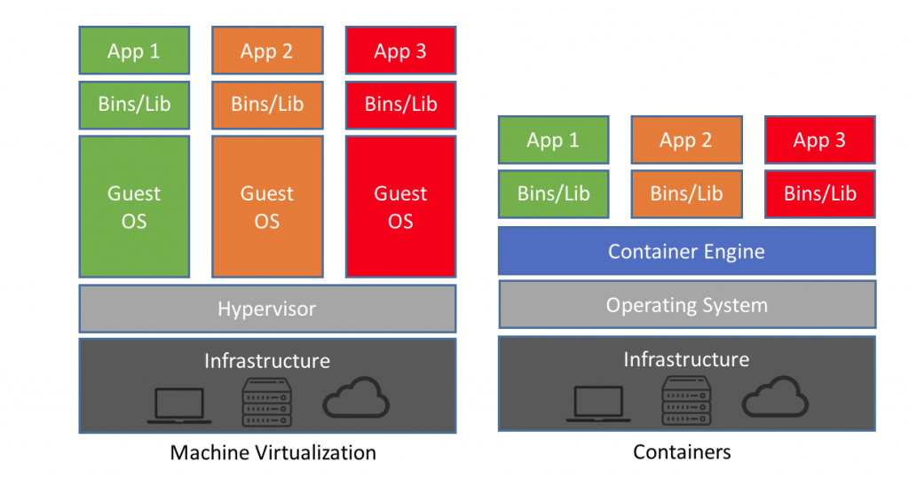

# Docker - Containers ?

## What is a container ?

First of all you should read the great doc from docker [What is a Container?](https://www.docker.com/resources/what-container)

Keep in mind that containers are a virtualization technology, based on existing Linux tools such as **cgroups** and **namespaces**.
Docker has been a long time dedicated to Unix machines. But now you can use it 
easily on [Windows](https://www.docker.com/products/windows-containers). 

A container is a lightweight box, which use the host machine's OS in order to work.
It is something portable, that ships an application and its dependencies and... thats it !

So if it is lightweight and portable, it is something **easier to build, deploy and destroy**
than any virtual machine.
It can be deployed as well on a virtual machine as on a bare-metal server.
See [this page from Docker's blog](https://www.docker.com/blog/containers-replacing-virtual-machines/)

## Security

Containers create a strong encapsulation, but it is another new abstraction level so 
it comes with its own vulnerabilities. You will have to be careful and respect
security recommendations, when configuring Docker Engine, when creating images,
when starting containers...etc. 
https://docs.docker.com/engine/security/security

## Next Step

&raquo; [Start your first container](./02-start-stop.md)

Or go back to [Home](../README.md)