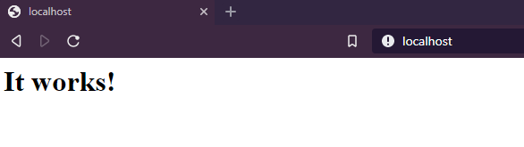

# Start your first container

Start your better command line executor.

- Check that you can run docker command.

```console
[docker@vm ~] docker --version
Docker version 19.03.5, build 633a0ea
```

- Add your current user to docker group (then restart your command line session...)

```shell script
sudo usermod -aG docker $USER
```

## Images VS Containers

Containers share with others virtualization technology some same concepts, for example: the **image**.

A container is instancied from a static *image*, just like a virtual machine. So a container is a new instance of an image, *as an object is a new instance of a class...*

Create a custom image will be developed later, for now you will download it from the main docker image registry, the **docker hub**.

Following this link in your browser: https://hub.docker.com/, you will find public images that you can use, like mysql, postgres, apache,
java, php...etc.

Now, we would like to download an image of HTTPD web server. Here we can find all versions provided by the Apache team.
https://hub.docker.com/_/httpd. 
We will try version 2.4. We need to use the command *pull* in order to do this.

```console
[docker@vm ~]$ docker pull httpd:2.4
2.4: Pulling from library/httpd
8d691f585fa8: Pull complete
8eb779d8bd44: Pull complete
574add29ec5c: Pull complete
30d7fa9ec230: Pull complete
ede292f2b031: Pull complete
Digest: sha256:35fcab73dc9ae55db5c4ac33f5e0c7e76b7735aaddb628366bab04db6f8ae96e
Status: Downloaded newer image for httpd:2.4
docker.io/library/httpd:2.4
```

HTTPD image version 2.4 has been download into your local machine. You can start use it !

## Start

To start a container, we will use command *run*, following by the identifier of the image to use.

Note: the identifier is always *NAME:TAG*, where the tag represent the version.

```shell script
docker run httpd:2.4
```

If you run the this command, docker will start a new httpd server, but you can't use it. Let me explain you why...
Use CTRL+C to get out from the running task.

## Port mapping

A container is a small box, within its own network. In fact, if HTTPD server is running on port 80, it is 
 only available from inside the container, so not from your host...
You need to explicitly tell to docker what ports should be forwarded to the host.
See https://docs.docker.com/config/containers/container-networking/

Now, run :
```shell script
docker run -p="80:80" httpd:2.4
```



Greaaaattt !! Now you can change if you want to expose your httpd server on another port.
(CTRL+C)

```shell script
docker run -p="8081:80" httpd:2.4
```

Verify that HTTPD is available on 8081.


## Background mode

Now, we are going to start the container in background mode.
Use option *-d*.

```console
[docker@vm ~]$ docker run -d -p="8081:80" httpd:2.4
029dcae1a5e8c4a465da0e0b0c737289d88f20cf9a7519f1ce767a135217614b
```

As you can see, you will get your hands on the command line.
Container is running in background, check it in your browser !

### Container ID

The ID which is printed in command line is important, because it is the identifier you will use to stop it or obtain more 
information about running processes.

## Lifecycle

- To stop a running container, use the container ID and command *stop*.

```console
[docker@vm ~]$ docker stop 029dcae1a5e8c4a465da0e0b0c737289d88f20cf9a7519f1ce767a135217614b
029dcae1a5e8c4a465da0e0b0c737289d88f20cf9a7519f1ce767a135217614b
```
Check in your browser that HTTPD has been stopped !

- Restart, use the container ID and command *start*.
```console
[docker@vm ~]$ docker start 029dcae1a5e8c4a465da0e0b0c737289d88f20cf9a7519f1ce767a135217614b
029dcae1a5e8c4a465da0e0b0c737289d88f20cf9a7519f1ce767a135217614b
```

- To see running containers, use command *ps*.
```console
[docker@vm ~]$ docker ps
CONTAINER ID        IMAGE               COMMAND              CREATED             STATUS              PORTS      
61821c89a3fd        httpd:2.4           "httpd-foreground"   5 minutes ago       Up 5 minutes        0.0.0.0:8081->80/tcp
```

By now, you are going the use *ps* everywhere all the time :smile:
Notice that it prints you another ID for your container, better, it is smaller, you'll better use this one !

- Question: where are going stopped containers ? Nowhere... they are just stopped... If you want definitively remove
a container, you will have to use the command *rm*. Try it with you running container.

```console
[docker@vm ~]$ docker rm 61821c89a3fd
Error response from daemon: You cannot remove a running container 61821c89a3fd2c218c8fbd5bf13ab6c0037a869c748e5e71416409bb66fb4583. Stop the container before attempting removal or force remove
```

Now you know that in order to remove a container, you must stop it !

The lifecycle of a container is:

STARTED :arrows_counterclockwise: STOPPED :arrow_right: REMOVED

```console
[docker@vm ~]$ docker stop 61821c89a3fd
61821c89a3fd
[docker@vm ~]$ docker rm 61821c89a3fd
61821c89a3fd
```

- To see all containers including those stopped, use *ps -a* 

```console
[docker@vm ~]$ docker ps -a
CONTAINER ID        IMAGE               COMMAND              CREATED             STATUS                      PORTS               
93adfe13787c        httpd:2.4           "httpd-foreground"   24 minutes ago      Created                                         
029dcae1a5e8        httpd:2.4           "httpd-foreground"   27 minutes ago      Exited (0) 24 minutes ago                       
ff57e979d5ed        httpd:2.4           "httpd-foreground"   27 minutes ago      Exited (0) 27 minutes ago                       
7f99194ed9f6        httpd:2.4           "httpd-foreground"   36 minutes ago      Exited (0) 36 minutes ago             
d0fc6b02c21c        httpd:2.4           "httpd-foreground"   49 minutes ago      Exited (0) 45 minutes ago                       
```

Note that you will find here also the containers you stopped at the beginning with CTRL+C...

You can use something like *docker stop $(docker ps -q)* in order to stop all running containers, or *docker rm $(docker ps -aq)*
 if you want to purge all containers, but be careful with these commands...

## Name your containers

Use a name is better than an ID. So you can use option *--name* in order to give a unique name to your containers.

```shell script
docker run --name "my-httpd-server" -p="8081:80" httpd:2.4 
```

- Start, stop and remove a container using a meaningful name.

## Process

In order to finish this small lesson, start a new container, and then run a **ps** (not the docker one, but the linux one) 
to see running processes in your host.

```console
[docker@vm ~]$ ps -ef
....
root      7338  2723  0 10:29 ?        00:00:00 /usr/bin/docker-proxy -proto tcp -host-ip 0.0.0.0 -host-port 8081 -container-ip 172.17
root      7344  2721  0 10:29 ?        00:00:00 containerd-shim -namespace moby -workdir /var/lib/containerd/io.containerd.runtime.v1.
root      7361  7344  0 10:29 ?        00:00:00 httpd -DFOREGROUND
bin       7402  7361  0 10:29 ?        00:00:00 httpd -DFOREGROUND
bin       7403  7361  0 10:29 ?        00:00:00 httpd -DFOREGROUND
bin       7404  7361  0 10:29 ?        00:00:00 httpd -DFOREGROUND
docker   7488  5350  0 10:30 pts/0    00:00:00 ps -ef
```

Notice that containers are running like any others linux processes !!!

To get further, see https://docs.docker.com/engine/reference/run/. 

## Next Step

&raquo; [Images and layers](./03-images-layers.md)

Or go back to [Containers ?](./01-containers.md)
