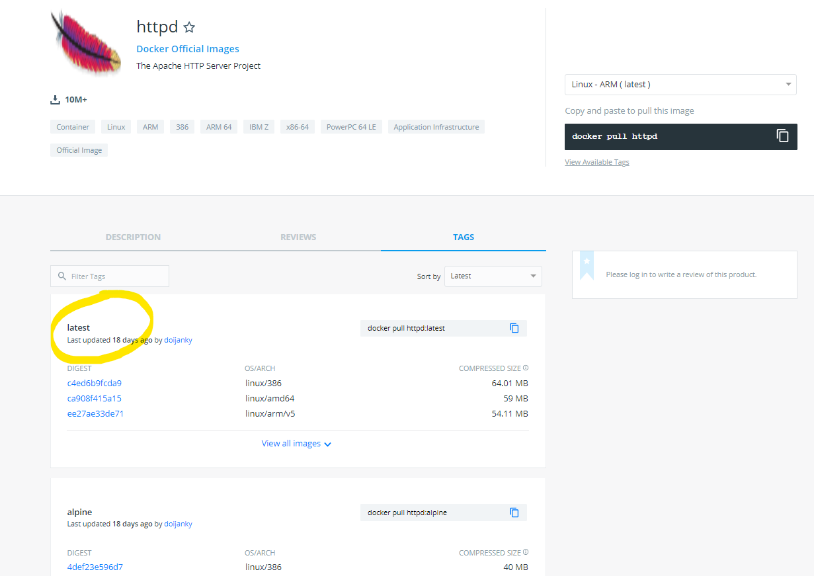

# Understand Docker images

Let go to see more about **images**.

## What is an image

You well know what is a Virtual Machine image, it is a complete machine with an OS.

So, what contains a container image if it does not contains an entire OS ?

In fact it looks like a light linux distribution, it contains some pieces of system programs and dependencies,
the least possible, the only ones necessary for your application.

If you like inside a container, you will find that it is just a linux file system, here an example of output:

```console
ls -l /
total 4
drwxr-xr-x.   1 root root    6 Oct 30 23:33 bin
drwxr-xr-x.   2 root root    6 Aug 30 12:31 boot
drwxr-xr-x.   5 root root  340 Nov 18 11:08 dev
drwxr-xr-x.   1 root root   66 Nov 18 11:08 etc
drwxr-xr-x.   2 root root    6 Aug 30 12:31 home
drwxr-xr-x.   1 root root   41 Oct 30 23:33 lib
drwxr-xr-x.   2 root root    6 Oct 14 00:00 media
drwxr-xr-x.   2 root root    6 Oct 14 00:00 opt
dr-xr-xr-x. 116 root root    0 Nov 18 11:08 proc
drwx------.   2 root root   37 Oct 14 00:00 root
drwxr-xr-x.   3 root root   30 Oct 14 00:00 run
drwxr-xr-x.   2 root root 4096 Oct 14 00:00 sbin
drwxr-xr-x.   2 root root    6 Oct 14 00:00 srv
dr-xr-xr-x.  13 root root    0 Nov 18 10:51 sys
drwxrwxrwt.   1 root root    6 Oct 30 23:32 tmp
drwxr-xr-x.   1 root root   19 Oct 14 00:00 usr
drwxr-xr-x.   1 root root   41 Oct 14 00:00 var
```

## Pull and run

On the previous exercice, you've downloaded an image by using the command *pull*.

- Start a command run with an image that you have not already download to see what happen.
For example use another version of httpd image.

```console
[docker@vm ~] docker run httpd:2.2
Unable to find image 'httpd:2.2' locally
2.2: Pulling from library/httpd
f49cf87b52c1: Pull complete
24b1e09cbcb7: Pull complete
8a4e0d64e915: Pull complete
bcbe0eb4ca51: Pull complete
16e370c15d38: Pull complete
Digest: sha256:9784d70c8ea466fabd52b0bc8cde84980324f9612380d22fbad2151df9a430eb
Status: Downloaded newer image for httpd:2.2
```

As you can see, a *pull* is automatically done by docker.

## Layers

On the *pull* output, you have to understand each line you see, especially those who show an ID follow by *Pull complete*.
These are the **layers**. Each image is divided into many **intermediate images**, called layers.
Some layers can be commons between images. It is important to remember, because the layer concept will be used
when you will create your own images.

## Storage

- Run the command *images* will show you informations about images stored locally.

```console
[docker@vm ~] docker images
REPOSITORY          TAG                 IMAGE ID            CREATED             SIZE
httpd               2.4                 d3017f59d5e2        2 weeks ago         165MB
httpd               2.2                 e06c3dbbfe23        22 months ago       171MB
```

As you can see the size of an image like httpd is 165MB. Much less than an entire virtual machine !

- Images and all docker data are stored in */var/lib/docker*.

```console
[docker@vm ~] sudo ls -l /var/lib/docker/
total 4
drwx------.  2 root root   24 Nov 18 08:16 builder
drwx--x--x.  4 root root   92 Nov 18 08:16 buildkit
drwx------.  3 root root   78 Nov 18 10:05 containers
drwx------.  3 root root   22 Nov 18 08:16 image
drwxr-x---.  3 root root   19 Nov 18 08:16 network
drwx------. 20 root root 4096 Nov 18 10:16 overlay2
drwx------.  4 root root   32 Nov 18 08:16 plugins
drwx------.  2 root root    6 Nov 18 10:04 runtimes
drwx------.  2 root root    6 Nov 18 08:16 swarm
drwx------.  2 root root    6 Nov 18 10:16 tmp
drwx------.  2 root root    6 Nov 18 08:16 trust
drwx------.  2 root root   25 Nov 18 08:16 volumes
```

So be careful, even if images are small, this folder */var/lib/docker* may be very large when you run many containers !

## Repository

By default, all images are pulled on the public docker hub. https://hub.docker.com/

But don't worry, you will be able later to build your own images, to push them inside a private secure repository, 
and pull images from it.

## Keyword : *Latest* 

If you browse all the tags available for an image, you will find a special version, called ***latest***.
https://hub.docker.com/_/httpd?tab=tags



It is the default version used when you don't specify any version at *pull* or *run*.

- See it by running a pull on httpd.

```console
[docker@vm ~] docker pull httpd
Using default tag: latest
```

**Please never use it !!!** The best thing to do is to always use a specific version such as 1.0, 2.0, 1.0-stable, stable...etc.

Why ? because the keyword *latest* is a confusion, it does not mean that what you are using is the most up-to-date image
or the most stable version. You are just using a version which have been called *latest*.

## Next Step

For now, these are the few things you need to known about images. You are ready to do more complex !

&raquo; [Docker commands and options](./04-docker-commands.md)

Or go back to [Start and stop](./02-start-stop.md)
