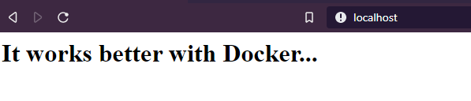

# Discover useful docker commands and options

You already know the basic commands of docker:

Command|Description
:---: | :---:
images|List local images
pull|Download remote images
run|Instanciate a new container
stop|Stop a container
start|Restart a stopped container
rm|Definitively remove a stopped container 

## A command inside a container

Ok, a container is a secure box in which our application is running.
But, can I enter please ? yeeaaaaah for sure you can ! how else to debug ?

*Enter* means *running commands* inside the virtual container.
 Remember, inside a container it is a linux based file system.

- Start a container in background.

```
docker run --name "my-httpd-server" -p="80:80" -d httpd:2.4 
```

- Use command *exec* to run some commands inside the container.
For example use *pwd* and *ls* to explore container content.

```console
[docker@vm ~] docker exec my-httpd-server pwd
/usr/local/apache2
[docker@vm ~] docker exec my-httpd-server ls -l
total 32
drwxr-xr-x. 2 root root  276 Oct 30 23:33 bin
drwxr-xr-x. 2 root root  167 Oct 30 23:33 build
drwxr-xr-x. 2 root root   78 Oct 30 23:33 cgi-bin
drwxr-xr-x. 4 root root   84 Oct 30 23:33 conf
drwxr-xr-x. 3 root root 4096 Oct 30 23:33 error
drwxr-xr-x. 2 root root   24 Oct 30 23:33 htdocs
drwxr-xr-x. 3 root root 8192 Oct 30 23:33 icons
drwxr-xr-x. 2 root root 4096 Oct 30 23:33 include
drwxr-xr-x. 1 root root   23 Nov 18 11:12 logs
drwxr-xr-x. 2 root root 8192 Oct 30 23:33 modules
```

- What about *vi* inside a container ?

```console
[docker@vm ~] docker exec my-httpd-server vi
OCI runtime exec failed: exec failed: container_linux.go:346: starting container process caused "exec: \"vi\": executable file not found in $PATH": unknown
```

Now, you are understanding that a lot of programs are missing. And that *vi* inside a container is not a good idea...

## Many commands inside a container

If you want to start a command line inside the container, you can run for example /bin/bash.
But you need option *-it* to tell docker to not quit the program.

- Enter in bash of your container. 

```console
[docker@vm ~] docker exec -it my-httpd-server /bin/bash
root@a32883b9e32b:/usr/local/apache2# pwd
/usr/local/apache2
root@a32883b9e32b:/usr/local/apache2# ls -l
total 32
drwxr-xr-x. 2 root root  276 Oct 30 23:33 bin
drwxr-xr-x. 2 root root  167 Oct 30 23:33 build
drwxr-xr-x. 2 root root   78 Oct 30 23:33 cgi-bin
drwxr-xr-x. 4 root root   84 Oct 30 23:33 conf
drwxr-xr-x. 3 root root 4096 Oct 30 23:33 error
drwxr-xr-x. 2 root root   24 Oct 30 23:33 htdocs
drwxr-xr-x. 3 root root 8192 Oct 30 23:33 icons
drwxr-xr-x. 2 root root 4096 Oct 30 23:33 include
drwxr-xr-x. 1 root root   23 Nov 18 11:12 logs
drwxr-xr-x. 2 root root 8192 Oct 30 23:33 modules
root@a32883b9e32b:/usr/local/apache2# cd /root/
root@a32883b9e32b:~# ls
root@a32883b9e32b:~# pwd
/root
```

Now you are inside the container, you can run many commands !!!

- Get out from the container with simple ***exit***

```console
root@a32883b9e32b:~# exit
exit
[docker@vm ~]
```

## Runtime environment

You can add environment properties that can be used by applications inside container, as containers
don't share host environment.

- Add option *-e* to run command, check by running *env* inside container.

```console
[docker@vm ~] docker run --name "my-httpd-server" -p="80:80" -d -e "MY_ENV=thevalue" -e "MY_ENV_2=thevalue2" httpd:2.4
03941d68178185607caa023210c8f4e1cafa0425cecb114851994a07fd607e4d
[docker@vm ~] docker exec my-httpd-server env
PATH=/usr/local/apache2/bin:/usr/local/sbin:/usr/local/bin:/usr/sbin:/usr/bin:/sbin:/bin
HOSTNAME=03941d681781
MY_ENV=thevalue
MY_ENV_2=thevalue2
HTTPD_PREFIX=/usr/local/apache2
HTTPD_VERSION=2.4.41
HTTPD_SHA256=133d48298fe5315ae9366a0ec66282fa4040efa5d566174481077ade7d18ea40
HTTPD_PATCHES=
HOME=/root
```

## Copy

You can't *vi* inside a container but you can modify files by copying them from your host to the container.

- Create a simple index.html on your host.

```
echo "<h1>It works better with Docker...</h1>" > index.html
```

- Override the default home page of HTTPD web server.

```
[docker@vm ~] docker cp index.html my-httpd-server:/usr/local/apache2/htdocs/index.html
```

- Check in your browser your modification. 



- You can inverse the command in order to copy something from the container into your host.

```
[docker@vm ~] docker cp my-httpd-server:/usr/local/apache2/htdocs/index.html index.html
```

Running command like ***exec*** or ***cp*** is really interesting for debugging purpose. In "normal" condition,
you will not use it.

## Logs

When you start a container, you start an application, a process.
Most processes have outputs. These are the logs.

- To print the logs of a container, simply use command *logs*.

```console
[docker@vm ~] docker logs my-httpd-server
AH00558: httpd: Could not reliably determine the server's fully qualified domain name, using 172.17.0.3. Set the 'ServerName' directive globally to suppress this message
AH00558: httpd: Could not reliably determine the server's fully qualified domain name, using 172.17.0.3. Set the 'ServerName' directive globally to suppress this message
[Mon Nov 18 11:12:25.978291 2019] [mpm_event:notice] [pid 1:tid 140271439099008] AH00489: Apache/2.4.41 (Unix) configured -- resuming normal operations
[Mon Nov 18 11:12:25.978403 2019] [core:notice] [pid 1:tid 140271439099008] AH00094: Command line: 'httpd -D FOREGROUND'
10.0.2.2 - - [18/Nov/2019:11:38:12 +0000] "GET / HTTP/1.1" 200 45
10.0.2.2 - - [18/Nov/2019:11:38:14 +0000] "GET / HTTP/1.1" 304 -
```

In our example, you will find the logs of the HTTPD application.

## Inspect

All properties of a container can be printed with *inspect* command.

```
docker inspect my-httpd-server
```

It will show you:

- General informations, id, date of creation, state...
- Network information such as container IP.
- Port mapping.
- Entrypoint (process running)

## Next Step

You are ready to know more about data in container.
(If you need more commands, see https://docs.docker.com/engine/reference/commandline/docker/.)

&raquo; [Data persistence](./05-stateful-containers.md)

Or go back to [Images and layers](./03-images-layers.md)
